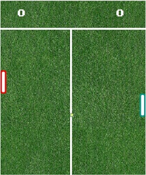
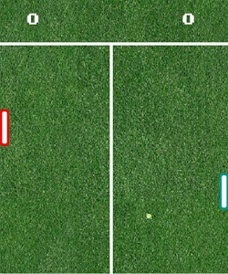
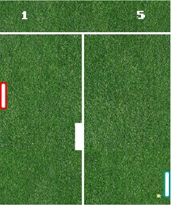

# Wimbledon-Pong

## Equipo de desarrollo

- Grupo: Compilando-ando
- Integrantes: FACUNDO GONZALEZ - ALEJANDRO COLQUE - HUGO EMANUEL IFRAN - IGNACIO COLMAN

## Capturas

   
  

## Reglas de Juego / Instrucciones

El juego está basado en el Pong lanzado por Atari en 1972, pero con algunos cambios tanto en lo visual como en la jugabilidad.

- Modo de juego - SINGLEPLAYER

El juego se plantea de manera indivudual contra el bot. El jugador 1 se encuentra a la izquierda mientras que el bot a la derecha. 

La pelota iniciará en el medio del tablero y avanzará a un lado aleatorio. (CUIDADO ES MUY RÁPIDA AL INICIO POR LO TANTO DEBERÁS ESTAR ATENTO PARA LLEGAR).

El partido se juega hasta 8 puntos. Si metiste 8 puntos ganaste y si te metieron 8 claramente perdiste. En ambos casos finaliza el juego.

A partir de cierta cantidad de puntos total del partido aparecerá un obstaculo.

- Modo de juego - MULTIPLAYER

El juego se plantea de la misma manera que el singleplayer con la diferencia de que se puede jugar con 2 jugadores.
El jugador 1 se posiciona a la izquierda mientras que el jugador 2 a la derecha.

- Controles

-Para seleccionar el modo Singleplayer: tecla C

-Para seleccionar el modo Multiplayer: tecla X

-El jugador 1 se mueve hacia arriba con la tecla W y con la tecla S hacia abajo

-El jugador 2 se mueve hacia arriba con la tecla Up(flecha arriba) y con la tecla Down(flecha abajo) hacia abajo

Con la barra espaciadora se finaliza el juego

## CUANDO EL JUEGO FINALIZA SE DEBERÁ CORRER EL JUEGO DE NUEVO TANTO PARA ELEGIR OTRO MODO ASÍ COMO PARA VOLVER A JUGAR EL MISMO AL QUE JUGASTE.
## UNA VEZ SELECCIONADO UN MODO DE JUEGO NO SE PUEDE CAMBIAR. SE DEBERÁ CORRER EL JUEGO DE NUEVO PARA SELECCIONAR OTRO MODO. 

## Otros

- Universidad de Hurlingham
- Comisión 1A - Objetos 1